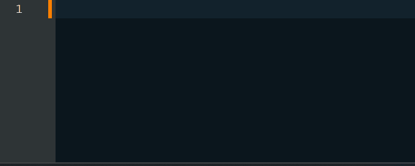
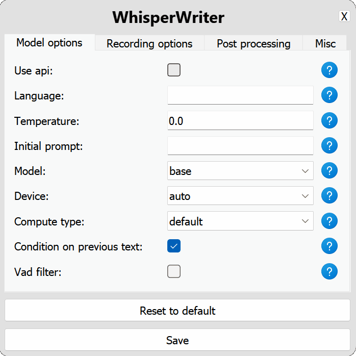

#  viapp


<p align="center">
    
</p>

viapp is a small speech-to-text app that uses a local, high-performance Whisper model to auto-transcribe recordings from a user's microphone to the active window.

Once started, the script runs in the background and waits for a keyboard shortcut to be pressed (`F9` by default). When the shortcut is pressed, the app starts recording from your microphone. There are four recording modes to choose from:
- `continuous` (default): Recording will stop after a long enough pause in your speech. The app will transcribe the text and then start recording again. To stop listening, press the keyboard shortcut again.
- `voice_activity_detection`: Recording will stop after a long enough pause in your speech. Recording will not start until the keyboard shortcut is pressed again.
- `press_to_toggle` Recording will stop when the keyboard shortcut is pressed again. Recording will not start until the keyboard shortcut is pressed again.
- `hold_to_record` Recording will continue until the keyboard shortcut is released. Recording will not start until the keyboard shortcut is held down again.

You can change the keyboard shortcut (`activation_key`) and recording mode in the [Configuration Options](#configuration-options). Once the transcription is complete, the transcribed text will be automatically written to the active window.

## Getting Started

### Prerequisites
Before you can run this app, you'll need to have the following software installed:

- Git: [https://git-scm.com/downloads](https://git-scm.com/downloads)
- Python `3.11`: [https://www.python.org/downloads/](https://www.python.org/downloads/)

If you want to run `faster-whisper` on your GPU, you'll also need to install the following NVIDIA libraries:

- [cuBLAS for CUDA 12](https://developer.nvidia.com/cublas)
- [cuDNN 8 for CUDA 12](https://developer.nvidia.com/cudnn)

<details>
<summary>More information on GPU execution</summary>

The below was taken directly from the [`faster-whisper` README](https://github.com/SYSTRAN/faster-whisper?tab=readme-ov-file#gpu):

**Note:** The latest versions of `ctranslate2` support CUDA 12 only. For CUDA 11, the current workaround is downgrading to the `3.24.0` version of `ctranslate2` (This can be done with `pip install --force-reinsall ctranslate2==3.24.0`).

There are multiple ways to install the NVIDIA libraries mentioned above. The recommended way is described in the official NVIDIA documentation, but we also suggest other installation methods below.

#### Use Docker

The libraries (cuBLAS, cuDNN) are installed in these official NVIDIA CUDA Docker images: `nvidia/cuda:12.0.0-runtime-ubuntu20.04` or `nvidia/cuda:12.0.0-runtime-ubuntu22.04`.

#### Install with `pip` (Linux only)

On Linux these libraries can be installed with `pip`. Note that `LD_LIBRARY_PATH` must be set before launching Python.

```bash
pip install nvidia-cublas-cu12 nvidia-cudnn-cu12

export LD_LIBRARY_PATH=`python3 -c 'import os; import nvidia.cublas.lib; import nvidia.cudnn.lib; print(os.path.dirname(nvidia.cublas.lib.__file__) + ":" + os.path.dirname(nvidia.cudnn.lib.__file__))'`
```

**Note**: Version 9+ of `nvidia-cudnn-cu12` appears to cause issues due its reliance on cuDNN 9 (Faster-Whisper does not currently support cuDNN 9). Ensure your version of the Python package is for cuDNN 8.

#### Download the libraries from Purfview's repository (Windows & Linux)

Purfview's [whisper-standalone-win](https://github.com/Purfview/whisper-standalone-win) provides the required NVIDIA libraries for Windows & Linux in a [single archive](https://github.com/Purfview/whisper-standalone-win/releases/tag/libs). Decompress the archive and place the libraries in a directory included in the `PATH`.

</details>

### Installation
To set up and run the project, follow these steps:

#### 1. Clone the repository:

```
git clone https://github.com/savbell/viapp
cd viapp
```

#### 2. Create a virtual environment and activate it:

```
python -m venv venv

# For Linux and macOS:
source venv/bin/activate

# For Windows:
venv\Scripts\activate
```

#### 3. Install the required packages:

```
pip install -r requirements.txt
```

#### 4. Run the Python code:

```
python run.py
```

#### 5. Configure and start viapp:
On first run, a Settings window should appear. Once configured and saved, the main window will open. Press the activation key (`F9` by default) to start recording and transcribing to the active window.

### Configuration Options

viapp uses a configuration file to customize its behaviour. To set up the configuration, open the Settings window:

<p align="center">
    
</p>

#### Model Options
- `common`: Options common to the local model.
  - `language`: The language code for the transcription in [ISO-639-1 format](https://en.wikipedia.org/wiki/List_of_ISO_639_language_codes). (Default: `null`)
  - `temperature`: Controls the randomness of the transcription output. Lower values make the output more focused and deterministic. (Default: `0.0`)
  - `initial_prompt`: A string used as an initial prompt to condition the transcription. More info: [OpenAI Prompting Guide](https://platform.openai.com/docs/guides/speech-to-text/prompting). (Default: `null`)

- `local`: Configuration options for the local Whisper model.
  - `model`: The model to use for transcription. The larger models provide better accuracy but are slower. See [available models and languages](https://github.com/openai/whisper?tab=readme-ov-file#available-models-and-languages). (Default: `small.en`)
  - `device`: The device to run the local Whisper model on. Use `cuda` for NVIDIA GPUs, `cpu` for CPU-only processing, or `auto` to let the system automatically choose the best available device. (Default: `auto`)
  - `compute_type`: The compute type to use for the local Whisper model. [More information on quantization here](https://opennmt.net/CTranslate2/quantization.html). (Default: `default`)
  - `condition_on_previous_text`: Set to `true` to use the previously transcribed text as a prompt for the next transcription request. (Default: `true`)
  - `vad_filter`: Set to `true` to use [a voice activity detection (VAD) filter](https://github.com/snakers4/silero-vad) to remove silence from the recording. (Default: `false`)
  - `model_path`: The path to the local Whisper model. If not specified, the default model will be downloaded. (Default: `null`)

#### Recording Options
- `activation_key`: The keyboard shortcut to activate the recording and transcribing process. Separate keys with a `+`. (Default: `F9`)
- `input_backend`: The input backend to use for detecting key presses. `auto` will try to use the best available backend. (Default: `auto`)
- `recording_mode`: The recording mode to use. Options include `continuous` (auto-restart recording after pause in speech until activation key is pressed again), `voice_activity_detection` (stop recording after pause in speech), `press_to_toggle` (stop recording when activation key is pressed again), `hold_to_record` (stop recording when activation key is released). (Default: `continuous`)
- `sound_device`: The numeric index of the sound device to use for recording. To find device numbers, run `python -m sounddevice`. (Default: `null`)
- `sample_rate`: The sample rate in Hz to use for recording. (Default: `16000`)
- `silence_duration`: The duration in milliseconds to wait for silence before stopping the recording. (Default: `900`)
- `min_duration`: The minimum duration in milliseconds for a recording to be processed. Recordings shorter than this will be discarded. (Default: `100`)

#### Post-processing Options
- `writing_key_press_delay`: The delay in seconds between each key press when writing the transcribed text. (Default: `0.005`)
- `remove_trailing_period`: Set to `true` to remove the trailing period from the transcribed text. (Default: `false`)
- `add_trailing_space`: Set to `true` to add a space to the end of the transcribed text. (Default: `true`)
- `remove_capitalization`: Set to `true` to convert the transcribed text to lowercase. (Default: `false`)
- `input_method`: The method to use for simulating keyboard input. The `auto` option will use `ydotool` on Linux if available, otherwise `pynput`. `ydotool` is a Linux-only tool that can provide more reliable input simulation. If you are on Linux, it is recommended to install `ydotool` and use this option. (Default: `auto`)
- `word_replacements`: A dictionary of words to replace in the transcribed text. For example, `{"gonna": "going to", "smiley face": "😊"}`. (Default: `{}`)

#### Miscellaneous Options
- `print_to_terminal`: Set to `true` to print the script status and transcribed text to the terminal. (Default: `true`)

## System Tray Menu

The application has a system tray icon with a dynamic context menu:
- **viapp Main Menu**: Shows the main window.
- **Start/Stop Recording**: Starts or stops the recording.
- **Settings**: Opens the settings window.
- **Exit**: Exits the application.
- `noise_on_completion`: Set to `true` to play a noise after the transcription has been typed out. (Default: `false`)

If any of the configuration options are invalid or not provided, the program will use the default values.

## Known Issues

You can see all reported issues and their current status in our [Issue Tracker](https://github.com/savbell/viapp/issues). If you encounter a problem, please [open a new issue](https://github.com/savbell/viapp/issues/new) with a detailed description and reproduction steps, if possible.

## Roadmap
Below are features I am planning to add in the near future:
- [ ] Additional post-processing options:
  - [ ] Simple word replacement (e.g. "gonna" -> "going to" or "smiley face" -> "😊")
- [ ] Creating standalone executable file

Below are features not currently planned:
- [ ] Pipelining audio files

Implemented features can be found in the [CHANGELOG](CHANGELOG.md).

## Contributing

Contributions are welcome! I created this project for my own personal use and didn't expect it to get much attention, so I haven't put much effort into testing or making it easy for others to contribute. If you have ideas or suggestions, feel free to [open a pull request](https://github.com/savbell/viapp/pulls) or [create a new issue](https://github.com/savbell/viapp/issues/new). I'll do my best to review and respond as time allows.

## Credits

- [Guillaume Klein](https://github.com/guillaumekln) for creating the [faster-whisper Python package](https://github.com/SYSTRAN/faster-whisper).
- All of our [contributors](https://github.com/savbell/viapp/graphs/contributors)!

## License

This project is licensed under the GNU General Public License. See the [LICENSE](LICENSE) file for details.
