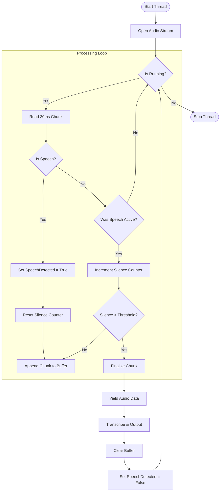

# Viapp Code Changes

## Change 1: VAD Logic Optimization (Silence Buffering)

> **Note:** This document outlines a critical improvement to the Voice Activity Detection (VAD) logic in `src/result_thread.py`.

### 1. Problem Analysis: The "Silence Stripping" Issue

#### Current Behavior

In the current implementation of `_process_audio_queue`, when the VAD detects speech, it sets a `speech_detected` flag and starts recording. However, when it detects a frame of silence *while* this flag is active (i.e., a pause between words), it increments a silence counter but **does not append the silent frame to the recording buffer**.

#### The Impact

This effectively "strips" all silence from the audio sent to the Whisper model.

- **Input**: "Hello [pause] World"
- **Audio Sent to Model**: "HelloWorld" (concatenated abruptly)

This unnatural concatenation destroys the prosody (rhythm) of speech. It can cause the Whisper model to:

1. Merge words together incorrectly.
2. Fail to recognize sentence boundaries.
3. Hallucinate text due to the unnatural speed of the audio.

### 2. Proposed Solution: Silence Buffering

To fix this, we must treat silence that occurs *during* an active speech segment as part of the speech. We should append these silent frames to the buffer until the silence threshold (e.g., 900ms) is reached, at which point we consider the sentence finished.

#### Key Changes

1. **Buffer Silence**: When `speech_detected` is True but `is_speech` is False, we must append the current frame to the `recording` list.
2. **Trim (Optional)**: Optionally, we can trim the *trailing* silence (the 900ms used to detect the end) before sending it to the model, but keeping it is usually harmless for Whisper.

### 3. Optimized Process Flow Diagram

The following diagram illustrates the **corrected** logic. The key difference is the arrow from `Silence > Threshold? -- No` pointing to `Buffer Chunk`, ensuring natural pauses are preserved.



### 4. Implementation Details

#### Target File: `src/result_thread.py`

We need to modify the `_process_audio_queue` method.

##### Current Code (Lines 232-233)

```python
                elif speech_detected:
                    silent_frame_count += 1
                    # Silent frame is IGNORED here
```

##### Proposed Code

```python
                elif speech_detected:
                    silent_frame_count += 1
                    recording.extend(frame)  # <--- CRITICAL FIX: Keep the silence
```

### 5. Benefits of this Change

1. **Natural Sounding Audio**: The audio passed to Whisper will sound like a normal recording, pauses included.
2. **Improved Accuracy**: Whisper relies on context and pacing. Preserving silence helps it distinguish between "Let's eat, Grandma" and "Let's eat Grandma".
3. **Robustness**: Reduces the chance of words being cut off if the VAD flickers briefly during a soft consonant.

---

## Change 2: Dynamic Silence Threshold

> **Note:** This section outlines a proposed improvement to make the silence threshold dynamic based on the user's speaking pace.

### 1. Problem Analysis: Static Thresholds

#### Current Behavior

The application uses a fixed silence threshold (default 900ms) to determine when a sentence has ended.

#### The Impact

- **Fast Talkers**: May feel the app is too slow to finalize sentences, waiting nearly a second after they stop speaking.
- **Slow Talkers**: May have their sentences cut off prematurely if they pause to think.

### 2. Proposed Solution: Adaptive Threshold

Implement a simple adaptive mechanism that adjusts the silence threshold based on the length of the current speech segment.

#### Logic

- **Short Utterances**: Use a shorter threshold (e.g., 500ms) for quick commands (e.g., "Yes", "No", "Stop").
- **Long Utterances**: Use a longer threshold (e.g., 1000ms-1200ms) for dictation, allowing for natural pauses for thought.

#### Implementation Strategy

1. Track the duration of the current `speech_detected` session.
2. If `duration < 2 seconds`: `silence_threshold = 500ms`
3. If `duration >= 2 seconds`: `silence_threshold = 1000ms`

### 3. Benefits

1. **Responsiveness**: Makes the app feel snappier for short commands.
2. **Forgiveness**: Prevents cutting off users during longer dictation sessions.
