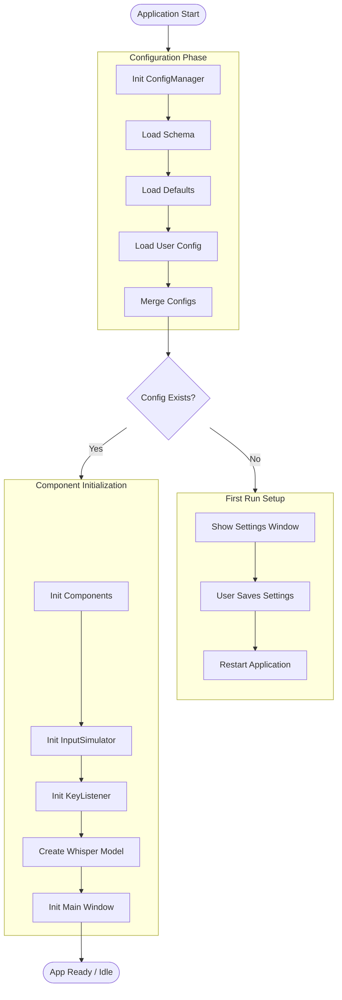
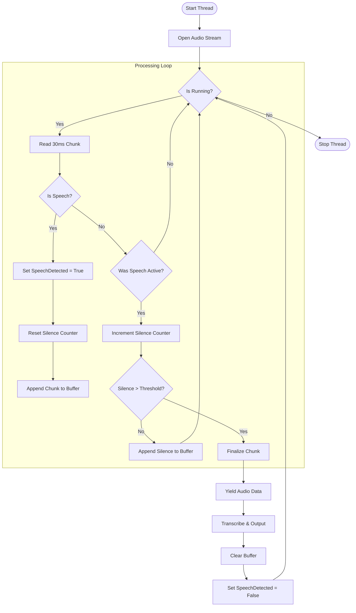
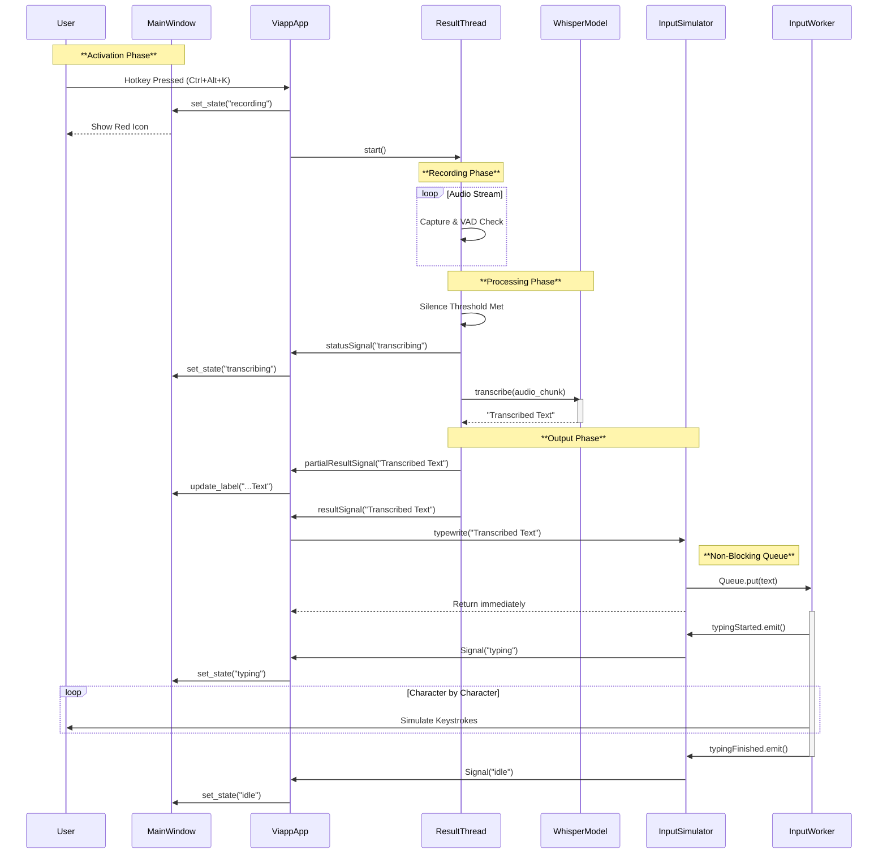
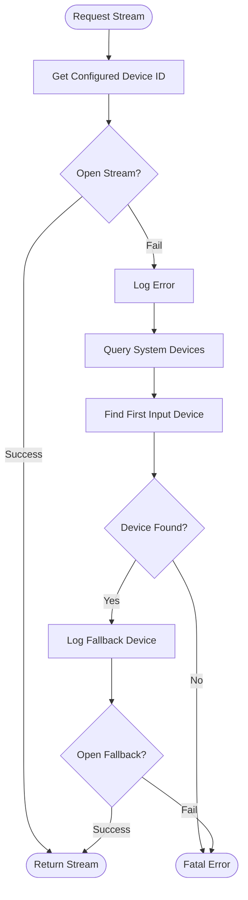
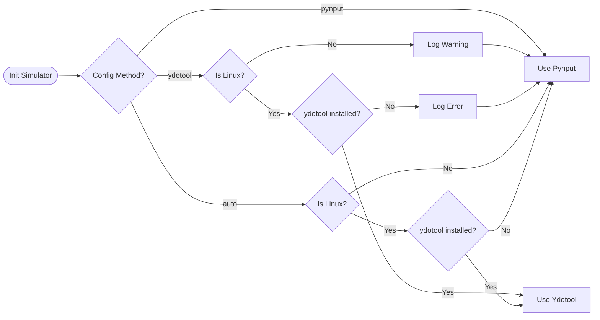

# Viapp Process Flow Diagrams

> **Note:** This document contains **Mermaid** diagrams. To view them:
>
> - **In VS Code**: Install the [Markdown Preview Mermaid Support](https://marketplace.visualstudio.com/items?itemName=bierner.markdown-mermaid) extension.
> - **On GitHub**: These diagrams will render automatically.
> - **Online**: Copy the code blocks into the [Mermaid Live Editor](https://mermaid.live/).

This document visualizes the optimized workflows of the Viapp application.

## 1. Application Initialization Flow

This diagram groups the startup process into logical phases: Configuration, Setup, and Initialization.

## 2. Audio Processing & VAD Logic

This flowchart details the `ResultThread` loop. **Note:** The current implementation now buffers silent frames during active speech to preserve natural prosody.

## 3. Transcription Sequence

This sequence diagram groups participants by layer (UI, Logic, Core) to clearly show the interaction boundaries, including the **asynchronous input queue**.

## 4. Audio Device Error Handling Strategy

This diagram uses a cleaner layout to show the fallback mechanism for audio devices.

## 5. Input Simulation Selection Logic

This diagram uses a Left-to-Right flow to visualize the decision tree for selecting the input method.

